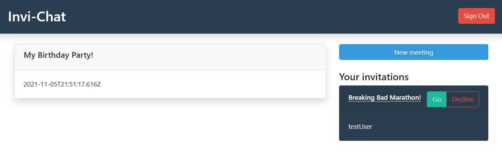

# Invi-Chat 

[Link to Invi-Chat](https://invi-chat.web.app/)

## What is invi chat? 
Invi-Chat is a web application, made with **React.js** for the user interface, and **Firebase** for the backend (with the use of Node.js cloud functions). 

With Invi-Chat, you can create meetings of any kind, select a location and a time for it, and invite as many of your friends as you want. You can describe the meeting and specify any details for your meeting.  

This project started out with the same exact principle as a React app, but now it supports user registration and authentication, it features the use of a map using Google Maps API, and much more!

## Demonstration 
In this section, a typical user experience while using the app.
### Home Page 
The home page is basically just a static html page showing off a basic description of the project, who is involved, how it started, and how it is developed.
### Log In 
User authentication is a big challenge in any kind of project. However, Firebase makes user authentication possible with just a few lines of code. With an implementation of Firebase's native authentication library inside an API, it is possible to authenticate users via an email and password.

### SignUp 
Taking advantage of the same firebase native library of authentication, we can create new users via an email and a passwrod.

### Dashboard 
The dashboard shows all the meetings that any user is attending, as well as any incoming invitation.

### Create Meeting

### Invite Someone

### Meeting 
This is the page that shows all details of a meeting, as well as a chat where all of the guests can interact. 

 

### Chat 

The real time chat is made possible by the use of firestore, the database available in Firebase. This database allows developers to synchronously query data from the database. This is made even simpler with the use of a library called **react-firebase-hooks**.  

